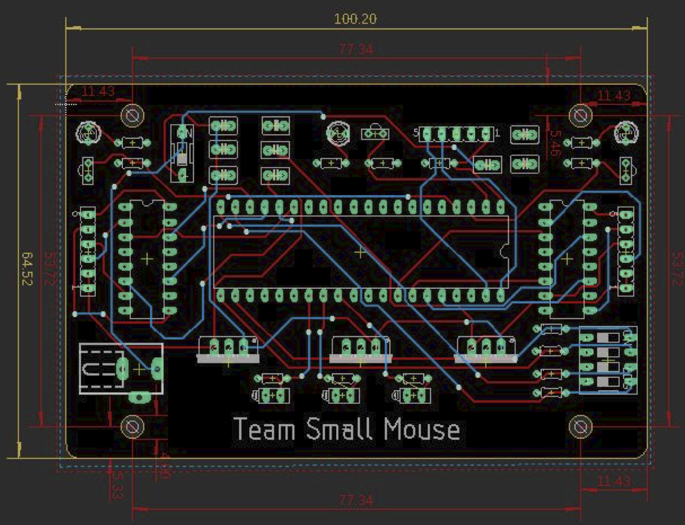
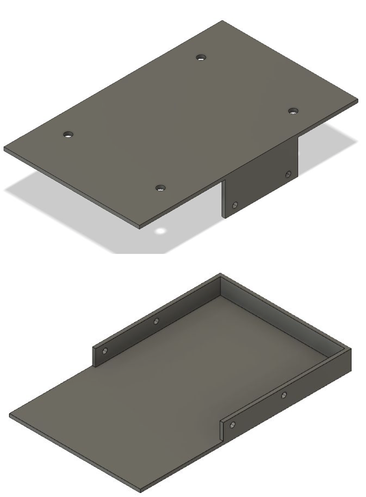

   
  

Micromouse is an event where small robot “mice” solve a 16 x 16 maze.  Events are held worldwide.  The maze is made up of a 16 by 16 gird of cells, each 180 mm square with walls 50 mm high.  The mice are completely autonomous robots that must find their way from a predetermined starting position to the central area of the maze unaided. Through the use of engineer design process and various hardware and software implementations such as circuit boards, pcbs, sensors, and more. The mouse will be able to track its own location within the maze and find its way back to the starting location without any bare to minimal collisions within the shortest time possible.

Within this project, I mainly worked with the software side of development specifically with debugging and doing various tests and experiments based on the output of our mouse. After figuring out how to work the adc code, I was able to make numerous plots to test the different kinds of adc values we were able to get in order to find the most optimal values for our mouse. Through many long days of working in the lab, staying long after school, and even spending most of spring break working on this project, we were able to complete the project as our Micromouse ran a left wall hugger algorithm to get to the center of the maze and right wall hugger to get back to its starting location.

This was the first major project I have done in college as it took all semester to complete and it was very amazing to see something that took so long to work finally be showcased at the day of competition. What I learned from taking part of Micromouse is the different kinds of applications I have learned from my EE classes and labs and how I was able to integrate them into the creation of our Micromouse. Overall, besides those long dreaded days in the lab during spring break, it was a fun project and tested my knowledge on what it takes to become an electrical engineer.

This is some of the hardware design we had:

  
  

You can learn more at the [UH Micromouse Website](http://www-ee.eng.hawaii.edu/~mmouse/about.html).

